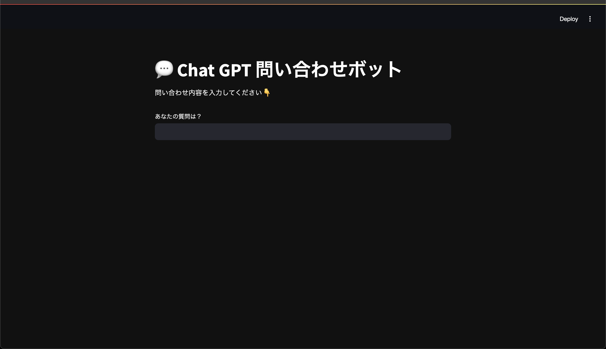
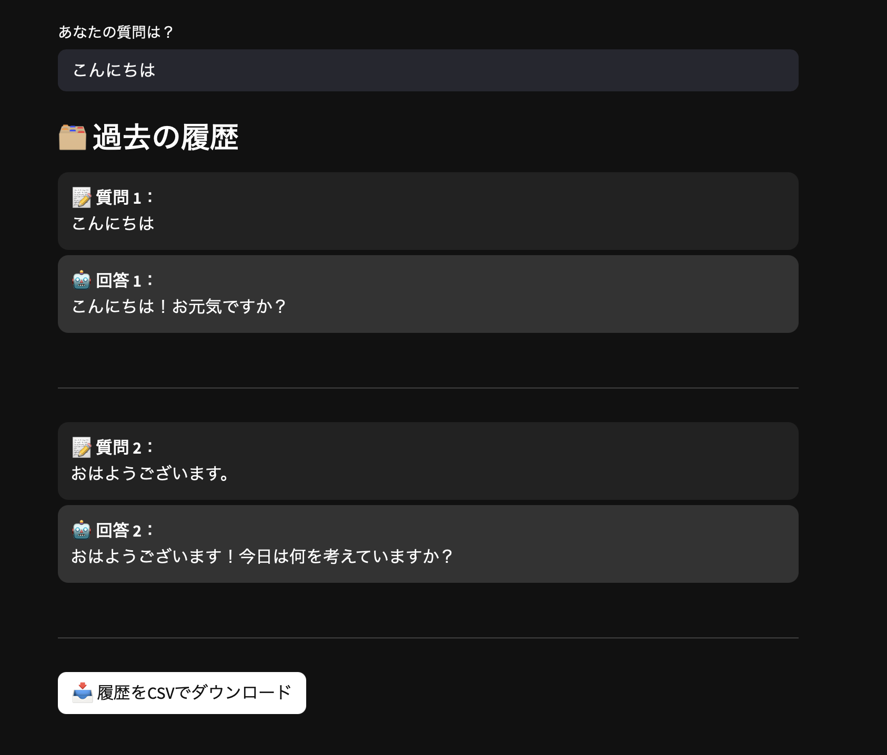

# 💬 ChatGPT 問い合わせボット（Streamlit × Groq）

業務に関する問い合わせやQA対応を想定した、**AIチャットボットのデモアプリ**です。  
シンプルなUIで質問を入力すると、GroqのLLaMA3モデルが自然な日本語で回答を返します。  
履歴の保存やダウンロードも可能で、業務内の**FAQ自動化**などへの応用を見据えた構成です。

---

## 🎯 想定ユースケース
•社内業務の問い合わせ対応（FAQ）ボット
•業務マニュアルに代わる自然言語インターフェース
•SAPや販売管理など他システム連携と併用したAI対応窓口

---

## 🚀 主な機能

- 🧠 AI（Groq API）による自然な日本語の回答生成
- 📝 ユーザー質問・AI回答の履歴表示
- 📥 CSV形式で履歴ダウンロード可能
- 🖤 ダークモード＋洗練されたUI（フォントや吹き出し風デザイン）

---

## 🛠 使用技術

- フレームワーク：Streamlit
- AIエンジン：Groq（LLaMA3）
- フォント：Noto Sans JP（Google Fonts）
- データ処理：pandas / io
- その他：dotenvでAPIキー管理

---

## 🖼 画面イメージ
### 🔽 実行画面


### 🔽 実行画面スマホ


---

🛠 セットアップ方法
1. Python（3.9〜3.11）をインストール
2. 以下のコマンドで必要なライブラリをインストール：pip install -r requirements.txt
3. .env ファイルを作成し、以下を記述：
GROQ_API_KEY=sk-xxxxxxxxxxxxxxxxxxxxxxxxxxxxxxxx
※ .env は GitHub にアップしないでください（.gitignore に含める）
4. アプリを起動：streamlit run streamlit_app.py
---

## 📦 セットアップ方法

1. Python 3.9〜3.11 をインストール
2. 以下のコマンドで必要なライブラリをインストール：

    ```bash
    pip install -r requirements.txt
    ```

3. `.env` ファイルを作成し、以下を記述：

    ```
    GROQ_API_KEY=sk-xxxxxxx  ← GroqのAPIキー 
    ```    

4. アプリを起動：

    ```bash
    streamlit run streamlit_app.py
    ```

---

## 📝 注意事項

- `.env` ファイルにはAPIキーを含むため、**絶対にGitHubへ公開しないでください**  

---

## 📄 ライセンス

このリポジトリは **MIT License** のもとで公開されています。

---

## 🧑‍💻 作者

- GitHub: `u8m`

---